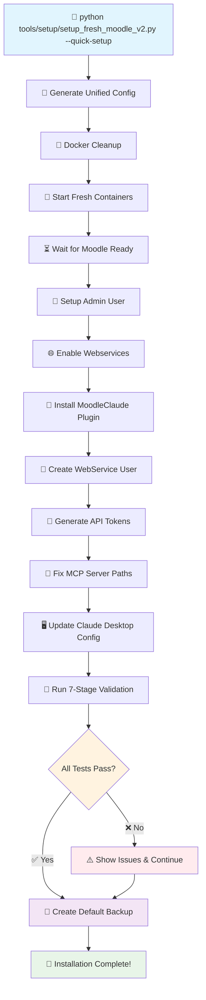
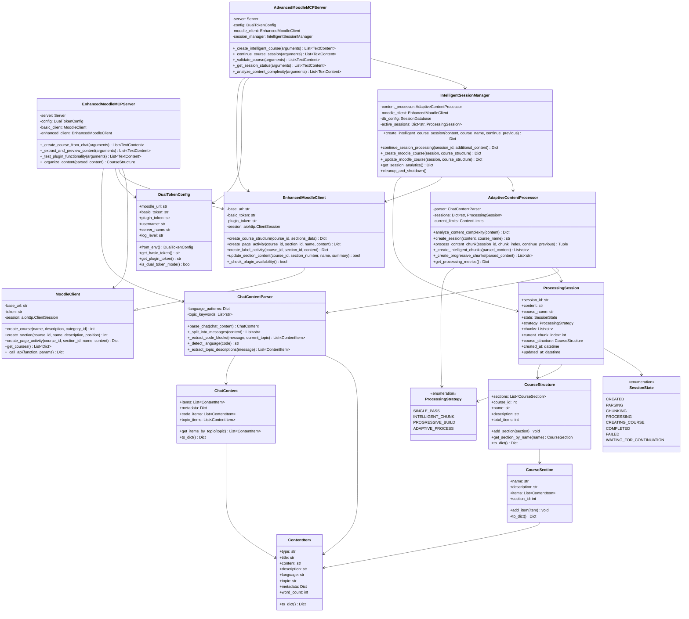

# Claude.Moodle-MCP-Server v3.0

**Automated Moodle course creation powered by Claude AI and MCP (Model Context Protocol)**

Transform Claude Desktop conversations into complete Moodle courses with activities, resources, and structured content.

## 🌟 **New in v3.0: One-Command Installation!**

```bash
python tools/setup/setup_fresh_moodle_v2.py --quick-setup
```

**⚡ 5-10 minutes → Complete MoodleClaude system ready!**  
No manual configuration, no token hunting, no setup headaches. Just works! 🎉

## 🚀 Quick Start

```bash
# ⚡ One-Command Installation (v3.0)
python tools/setup/setup_fresh_moodle_v2.py --quick-setup

# That's it! 🎉 
# - Complete Moodle environment
# - MoodleClaude plugin installed
# - API tokens generated
# - Claude Desktop configured
# - Default backup created
```

**⏱️ Installation time: ~5-10 minutes**  
**🎯 Result: Ready-to-use MoodleClaude system**

## 📁 Project Structure

The project is now organized into logical directories:
- **`operations/`** - Backup, setup, and Docker configurations  
- **`server/`** - MCP server implementations
- **`src/`** - Core source code with v3.0 architecture
- **`documentation/`** - User guides and documentation
- **`tests/`** - Comprehensive test suite

See [DIRECTORY_STRUCTURE.md](DIRECTORY_STRUCTURE.md) for complete organization details.

## ✨ Features

- **🤖 AI-Powered Content Creation**: Transform Claude conversations into structured courses
- **⚡ One-Command Setup**: Complete installation in minutes
- **🔧 Centralized Configuration**: Single Source of Truth system
- **🎫 Automatic Token Generation**: Admin + WSUser tokens created automatically
- **💾 Auto-Backup System**: Default backups after successful installation
- **📚 Rich Activities**: Create pages, labels, files, and structured sections
- **🔒 Secure Authorization**: "Authorised users only" support
- **🚀 Complete Automation**: From chat to course in seconds
- **🐳 Docker Environment**: Ready-to-use Moodle setup
- **🧪 7-Stage Validation**: Comprehensive system testing

## 🛠️ Installation

### **Prerequisites**
- Docker and Docker Compose
- Python 3.8+
- Git

### **Automated Installation (Recommended)**

1. **Clone the repository**
   ```bash
   git clone https://github.com/sijadev/MCP-MoodleServer-ClaudeDesktop.git
   cd MCP-MoodleServer-ClaudeDesktop
   ```

2. **Run the automated setup**
   ```bash
   python tools/setup/setup_fresh_moodle_v2.py --quick-setup
   ```

3. **Restart Claude Desktop**
   - Essential for MCP server integration
   - Go to Settings → Restart Application

**That's it! 🎉 Your Claude.Moodle system is ready to use.**

### **What the Setup Does Automatically**
✅ Creates fresh Docker containers (PostgreSQL + Moodle)  
✅ Installs MoodleClaude plugin  
✅ Sets up admin user: `admin/MoodleClaude2025!`  
✅ Creates webservice user: `wsuser/MoodleClaudeWS2025!`  
✅ Generates API tokens automatically  
✅ Configures Claude Desktop MCP server  
✅ Runs comprehensive validation tests  
✅ Creates default backup  

### **Manual Setup (Advanced Users)**
For detailed manual installation, see [SETUP_GUIDE_V3.md](SETUP_GUIDE_V3.md)

## 🔧 Configuration

**🎯 No manual configuration needed!** The automated setup handles everything.

### **Configuration Management**
All settings are managed through the centralized configuration system:

```bash
# View current configuration
python tools/config_manager.py show

# Validate configuration consistency
python tools/config_manager.py validate

# Sync all configuration files
python tools/config_manager.py sync-all

# Update API tokens (if needed)
python tools/config_manager.py update-tokens --admin-token "new_token"
```

### **Access Credentials**
- **Moodle Admin**: `admin/MoodleClaude2025!` → http://localhost:8080
- **WebService User**: `wsuser/MoodleClaudeWS2025!`
- **Database**: PostgreSQL on port 5432
- **PgAdmin**: http://localhost:8082

For advanced configuration, see [README_CONFIG_MANAGEMENT.md](README_CONFIG_MANAGEMENT.md)

## 🧪 Testing

**🎯 Automatic testing included!** The setup runs comprehensive validation tests.

### **Manual Testing**
```bash
# Test the complete v3.0 workflow
python tools/test_fresh_workflow.py

# Validate current system
python tools/config_manager.py validate

# Test MCP server connectivity
python server/mcp_server_launcher.py --test
```

### **Course Creation Testing**
1. **Open Claude Desktop**
2. **Start a conversation** 
3. **Ask Claude to create a Moodle course** from your chat content
4. **Check results** at http://localhost:8080

## 📊 System Diagrams

### 🔄 v3.0 Setup Workflow



### 🔗 MCP Server & Claude Desktop Communication

```mermaid
sequenceDiagram
    participant CD as 🖥️ Claude Desktop
    participant MCP as 🔧 MCP Server Launcher
    participant Server as 🚀 Robust MCP Server
    participant Moodle as 🎓 Moodle Instance
    participant DB as 🗄️ PostgreSQL

    Note over CD,DB: System Startup & Configuration
    CD->>MCP: Launch MCP Server
    MCP->>MCP: Fix Python Paths
    MCP->>Server: Import & Initialize
    Server->>Server: Load Master Config
    Server->>Moodle: Validate API Tokens
    Moodle-->>Server: ✅ Connection OK
    Server-->>CD: 🟢 MCP Server Ready

    Note over CD,DB: Course Creation Flow
    CD->>Server: create_intelligent_course(content)
    Server->>Server: Analyze Content Complexity
    Server->>Moodle: Create Course Structure
    Moodle->>DB: Store Course Data
    DB-->>Moodle: ✅ Course Created
    Server->>Moodle: Add Activities & Resources
    Moodle->>DB: Store Activities
    DB-->>Moodle: ✅ Activities Added
    Server->>Moodle: Finalize Course
    Moodle-->>Server: 📚 Course Complete
    Server-->>CD: ✅ Course Created Successfully

    Note over CD,DB: Real-time Updates
    CD->>Server: get_session_status()
    Server->>DB: Query Session Data
    DB-->>Server: Session Info
    Server-->>CD: 📊 Current Progress

    Note over CD,DB: Error Handling
    CD->>Server: continue_course_session()
    Server->>Moodle: API Request
    Moodle-->>Server: ❌ API Error
    Server->>Server: Log Error & Retry
    Server->>Moodle: Retry Request
    Moodle-->>Server: ✅ Success
    Server-->>CD: 🔄 Session Continued

    style CD fill:#e3f2fd
    style Server fill:#e8f5e8
    style Moodle fill:#fff8e1
    style DB fill:#f3e5f5
```

## 🏗️ Architecture Overview

Claude.Moodle uses a layered architecture with intelligent session management and adaptive content processing:



### Key Architecture Components

#### 🎯 **MCP Server Layer**
- **AdvancedMoodleMCPServer**: Advanced server with intelligent session management and adaptive processing
- **EnhancedMoodleMCPServer**: Enhanced server with dual-token support and plugin functionality

#### 🧠 **Session Management Layer**
- **IntelligentSessionManager**: Orchestrates course creation with database persistence and analytics
- **AdaptiveContentProcessor**: Analyzes content complexity and selects optimal processing strategies

#### 📝 **Content Processing Layer**
- **ChatContentParser**: Extracts structured content from Claude conversations
- **ProcessingStrategy**: Defines content processing approaches (single-pass, chunked, progressive, adaptive)

#### 🌐 **Client Layer**
- **EnhancedMoodleClient**: Full-featured client using custom MoodleClaude plugin
- **MoodleClient**: Basic client for standard Moodle Web Services API

#### 📊 **Data Layer**
- **ContentItem**: Individual pieces of content (code blocks, topics, descriptions)
- **ChatContent**: Parsed conversation with metadata and organization
- **CourseStructure**: Complete Moodle course representation with sections and activities

### Data Flow

1. **Input** → Chat content enters through MCP server
2. **Parsing** → ChatContentParser extracts ContentItems into ChatContent
3. **Analysis** → AdaptiveContentProcessor analyzes complexity and selects strategy
4. **Session** → IntelligentSessionManager creates ProcessingSession with database persistence
5. **Processing** → Content is chunked and processed according to selected strategy
6. **Creation** → EnhancedMoodleClient creates CourseStructure in Moodle
7. **Validation** → System validates creation and provides analytics

## 📖 Documentation

### **🚀 v3.0 Documentation**
- **[INSTALLATION_V3.md](INSTALLATION_V3.md)** - Quick start guide for v3.0
- **[SETUP_GUIDE_V3.md](SETUP_GUIDE_V3.md)** - Comprehensive v3.0 setup guide  
- **[README_CONFIG_MANAGEMENT.md](README_CONFIG_MANAGEMENT.md)** - Configuration system
- **[BACKUP_SYSTEM_UPDATE.md](BACKUP_SYSTEM_UPDATE.md)** - Auto-backup documentation

### **🏗️ System Architecture**
- **System Diagrams** - See above for visual workflow and communication diagrams
- **[DIRECTORY_STRUCTURE.md](DIRECTORY_STRUCTURE.md)** - Project organization
- **Architecture Overview** - See above for detailed class diagrams

### **🔧 Advanced Topics**
- **[docs/INDEX.md](docs/INDEX.md)** - Complete documentation index
- **Manual Setup** - For advanced users who prefer manual installation
- **Plugin Development** - Custom Moodle plugin in `moodle_plugin/local_moodleclaude/`

## 🤝 Contributing

1. Fork the repository
2. Create a feature branch
3. Make your changes
4. Run the test suite
5. Submit a pull request

## 📄 License

This project is licensed under the Apache License 2.0 - see the [LICENSE](LICENSE) file for details.

## 🎯 Quick Links

### **🚀 Getting Started**
- **Installation**: `python tools/setup/setup_fresh_moodle_v2.py --quick-setup`
- **Configuration**: `python tools/config_manager.py show`
- **Testing**: `python tools/test_fresh_workflow.py`
- **Moodle Admin**: http://localhost:8080 (`admin/MoodleClaude2025!`)

### **📚 Documentation**
- **Quick Start**: [INSTALLATION_V3.md](INSTALLATION_V3.md)
- **Complete Guide**: [SETUP_GUIDE_V3.md](SETUP_GUIDE_V3.md)
- **Configuration**: [README_CONFIG_MANAGEMENT.md](README_CONFIG_MANAGEMENT.md)
- **Backup System**: [BACKUP_SYSTEM_UPDATE.md](BACKUP_SYSTEM_UPDATE.md)

### **🔧 System Components**
- **Plugin**: [moodle_plugin/local_moodleclaude/](moodle_plugin/local_moodleclaude/)
- **MCP Server**: [server/mcp_server_launcher.py](server/mcp_server_launcher.py)
- **Config Manager**: [tools/config_manager.py](tools/config_manager.py)
- **Setup Script**: [tools/setup/setup_fresh_moodle_v2.py](tools/setup/setup_fresh_moodle_v2.py)
