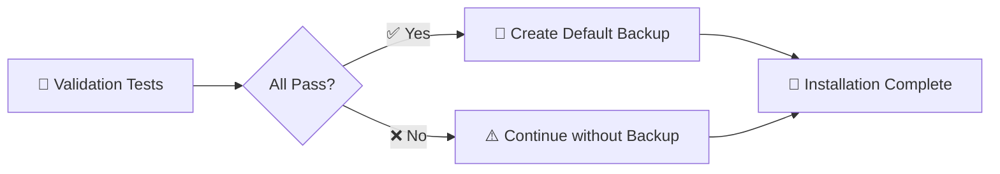

# 💾 Automatic Backup System v3.0

## ✅ Neues Feature: Auto-Backup nach Installation

**Nach jedem erfolgreichen Setup wird automatisch ein Default-Backup erstellt:**

### 📁 Backup-Location:
```
operations/backup/defaults/
├── moodle_fresh_default.sql    # PostgreSQL Database Dump (~2MB)
└── README.md                   # Backup Documentation
```

### 🔄 Wann wird Backup erstellt:
- ✅ **Automatisch** nach erfolgreichem `setup_fresh_moodle_v2.py`
- ✅ **Nach allen Validierungstests** (Schritt 13 von 14)
- ✅ **Nur bei vollständig funktionierendem System**

### 📊 Backup-Inhalt:
- **Complete Database** mit allen Kursen, Benutzern, Konfigurationen
- **MoodleClaude Plugin** installiert und konfiguriert
- **API Tokens** generiert und funktionsfähig
- **WebService User** erstellt und authorisiert
- **Admin-Zugang** bereit: `admin/MoodleClaude2025!`

### 🚀 Restore-Optionen:

#### **Option 1: Fresh Setup (empfohlen)**
```bash
# Komplett neues Setup (wie jetzt installiert)
python tools/setup/setup_fresh_moodle_v2.py --quick-setup
```

#### **Option 2: Database Restore (manuell)**
```bash
# Container starten, dann:
docker exec -i moodleclaude_postgres_fresh psql -U moodle -d moodle_fresh < operations/backup/defaults/moodle_fresh_default.sql
```

### 🎯 Integration in Setup-Workflow:



### 📋 Backup-Details:

**Dateigrößen:**
- Database Dump: ~2MB (komprimiert)
- README.md: ~500 bytes

**Backup-Inhalt:**
- 🗄️ Komplette Moodle-Datenbank
- 👥 Admin + WSUser accounts
- 🔧 Plugin-Konfiguration
- 🎫 API Token-Referenzen
- 📚 Kurse und Aktivitäten

**Restore-Zeit:** ~5-10 Minuten (Fresh Setup)

---

**🎯 Resultat: Nach jeder erfolgreichen Installation steht automatisch ein funktionierendes Backup zur Verfügung!**